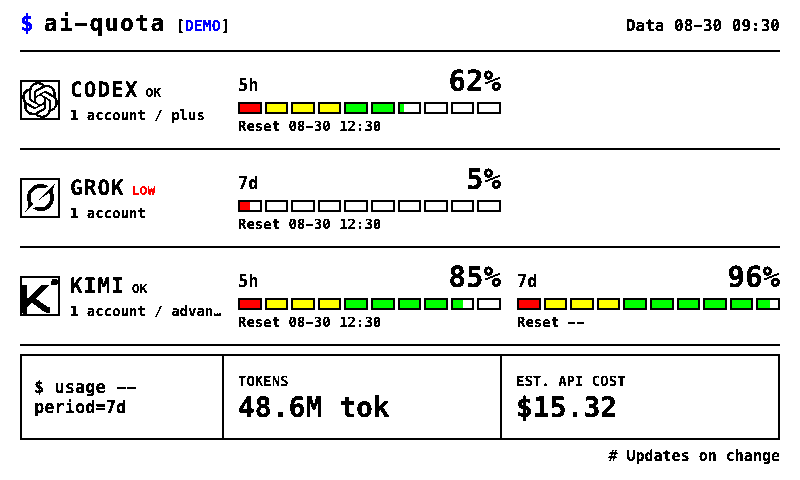

# AI Quota Frame

`ai-quota-frame` 是一个可运行的局域网 MVP：主机从本机 [CLIProxyAPI](https://github.com/router-for-me/CLIProxyAPI) 枚举 OAuth 账号并代理查询额度，对结果做归一化和脱敏，再向局域网提供 JSON 与 800x480 PNG。微雪 ESP32-S3 E6 PhotoPainter 定时请求 PNG，只在内容 ETag 改变时刷新电子纸。

```text
provider OAuth credentials
          |
          v
CLIProxyAPI management API       remains on host loopback
          |
          v
ai-quota-frame :8787             normalize, redact, render, ETag
          |
          |  trusted LAN + independent Bearer token
          v
ESP32-S3-PhotoPainter            GET frame.png, 304 => no panel refresh
```

OAuth access token、refresh token、CLIProxyAPI management key、`auth_index` 和凭据文件都不会下发给相框。相框只保存一个独立的 `FRAME_ACCESS_TOKEN`。

实际 800x480 PNG 输出预览（蓝色 `DEMO` 徽标表示演示 fixture；真实额度成功刷新时显示 `LIVE`）：



## 当前 MVP 范围

主动额度适配器：

| CLIProxyAPI provider | 归一化数据 | 800x480 画面 |
|---|---|---|
| Codex | 5h、7d 及上游返回的扩展窗口 | `CODEX` |
| Claude | 5h、7d、模型/功能限定窗口 | `CLAUDE` |
| Gemini CLI | Pro、Flash 及其他 bucket | `GEMINI` |
| Antigravity | 5h、weekly 及 quota-summary bucket | 并入 `GEMINI` |
| Kimi | 5h（300 分钟）与 7d 窗口 | `KIMI` |
| xAI / Grok | Grok Build 共享周额度 | `GROK` |

`GET /api/v1/quota` 可见 CLIProxyAPI 中其他被明确标记为 OAuth 的 provider；尚无已核验额度适配器时，它们会以 `unknown` 和警告呈现，不会伪造 `0%`。800x480 画面默认显示 `CODEX` / `GROK` / `KIMI` 三行，可通过 `DISPLAY_PROVIDERS` 改成任意最多 5 个订阅类型（例如 `codex,claude,google`）。Gemini CLI 与 Antigravity 可用 `google` 或 `gemini-cli+antigravity:GEMINI` 合并到同一行。

主机对原始 email 做如 `j***@example.com` 的遮罩。CLIProxyAPI 中显式配置的 `label` / `note` 被视为操作者选定的显示别名，会截断后出现在 JSON API 中；不要在该字段放敏感信息。当前画面不显示账号名或别名。

配置了 CPAMP 用量采集后，画面下半部分以终端风总量卡显示近 7 日 token 总量与 API 折合价格；没有可验证的按日数据时明确显示 `UNAVAILABLE`。

每个额度窗口使用 10 格复古终端进度条，每格代表 10%：0–10% 区间为红色、10–40% 为黄色、40–100% 为绿色；当前格按实际百分比硬切分填充，不使用渐变或抖动。

Headless Chromium 截图会在主机端做一次无抖动量化，最终 PNG 只包含 Spectra 6 的理论黑、白、黄、红、蓝、绿六色。PhotoFrame v2.18 会把这种 800x480 PNG 识别为已预处理图片，跳过设备端 tone mapping 与 dithering，避免文字抗锯齿灰阶扩散成彩色噪点。

## 硬件前提

当前目标是微雪 **ESP32-S3-PhotoPainter**：7.3 英寸、800x480、六色 Spectra 6、ESP32-S3-WROOM-1-N16R8。它不是 `ESP32-S3-ePaper-13.3E6` 裸板。实际刷写前必须核对购买链接或 PCB 上的 SKU。

设备侧直接复用 `aitjcize/esp32-photoframe` 已验证的 `waveshare_photopainter_73` board HAL 与微雪驱动，不在本项目中重写 E6 驱动。E6 全屏刷新约需 25 秒且不支持快刷，所以 ETag/304 是正确性约束，不只是网络优化。

固件、PlatformIO/esptool 刷写、首次 Wi-Fi 配网和 SKU 证据详见 [docs/device.md](docs/device.md)。

## 软件前提

- Go 1.24 或更新的兼容工具链（当前 `go.mod` 因 Chromium 截图依赖为 Go 1.26）。
- 主机已安装 **Chromium 或 Google Chrome**（用于把 HTML/CSS 模板截图成 PNG；Docker 镜像已内置 `chromium`）。
- 已在主机运行并完成 OAuth 账号管理的 CLIProxyAPI。
- CLIProxyAPI management API 保持在 loopback，推荐 `http://127.0.0.1:8317`，并设置强 management key。
- 相框与主机处于可互通的受信 2.4 GHz LAN/VLAN。

本服务会拒绝指向非 loopback 主机的明文 `CLIPROXY_BASE_URL=http://...`。如果 CLIProxyAPI 确实在另一台主机，必须使用可验证证书的 `https://...`。不支持把 management key 通过远程明文 HTTP 发送。

可在不打印 auth-file 内容的情况下检查 management API：

```bash
curl -sS -o /dev/null -w '%{http_code}\n' \
  -H "Authorization: Bearer ${CLIPROXY_MANAGEMENT_KEY}" \
  http://127.0.0.1:8317/v0/management/auth-files
```

应输出 `200`。OAuth 登录、刷新和 auth-file 生命周期均由 CLIProxyAPI 负责，本项目不提供另一套 OAuth 登录流。

## 快速验证：演示模式

演示模式不访问 CLIProxyAPI，用于先验证主机 API、画面和 ETag。

```bash
cd ai-quota-frame
LISTEN_ADDR=127.0.0.1:8787 make demo
```

另开终端：

```bash
curl -fsS http://127.0.0.1:8787/healthz

curl -fsS \
  -H 'Authorization: Bearer demo-frame-token' \
  http://127.0.0.1:8787/api/v1/quota | python3 -m json.tool

curl -fsS \
  -H 'Authorization: Bearer demo-frame-token' \
  -H 'X-Display-Width: 800' \
  -H 'X-Display-Height: 480' \
  -D /tmp/ai-quota-frame.headers \
  -o /tmp/ai-quota-frame.png \
  http://127.0.0.1:8787/api/v1/frame.png

FRAME_ETAG=$(awk 'tolower($1) == "etag:" { sub(/\r$/, "", $2); print $2 }' \
  /tmp/ai-quota-frame.headers)
curl -sS -o /dev/null -w '%{http_code}\n' \
  -H 'Authorization: Bearer demo-frame-token' \
  -H "If-None-Match: ${FRAME_ETAG}" \
  http://127.0.0.1:8787/api/v1/frame.png
```

PNG 应为 800x480，包含额度百分比、重置时间、数据更新时间，顶部明确显示 `DEMO`，账号行可显示 `LOW` / `ERROR` 等状态；最后一条命令应输出 `304`。真实模式成功刷新时顶部显示 `LIVE`，整体失去新鲜数据时显示 `STALE`。结束演示服务时按 `Ctrl-C`。

## 真实主机运行

### 1. 配置

```bash
cp .env.example .env
chmod 600 .env
```

编辑 `.env`，至少替换两个独立的密钥：

```dotenv
LISTEN_ADDR=:8787
CLIPROXY_BASE_URL=http://127.0.0.1:8317
CLIPROXY_MANAGEMENT_KEY=replace-with-the-real-management-key
FRAME_ACCESS_TOKEN=replace-with-a-different-long-random-token
```

`FRAME_ACCESS_TOKEN` 可用 `openssl rand -hex 32` 生成，不得复用 `CLIPROXY_MANAGEMENT_KEY`。其余参数及默认值：

| 变量 | 默认值 | 约束 |
|---|---:|---|
| `REFRESH_INTERVAL` | `5m` | 至少 `1m` |
| `PASSIVE_MAX_AGE` | `24h` | Claude/Codex Header 回退最大年龄；`0` 禁用回退 |
| `REQUEST_TIMEOUT` | `20s` | `1s` 到 `2m` |
| `MAX_CONCURRENCY` | `4` | `1` 到 `32` |
| `TZ` | `Asia/Shanghai` | Go 时区名，用于 PNG 上的时间 |
| `DISPLAY_PROVIDERS` | `codex,xai,kimi` | 画面上的 OAuth 订阅行，最多 5 个；格式 `id[+id...][:LABEL]`，例如 `codex,claude,google` |
| `DEMO_MODE` | `false` | 真实运行保持 `false` |
| `ALLOW_INSECURE_NO_TOKEN` | `false` | 只允许在隔离开发环境临时使用；无 token 时仅接受显式 loopback 监听地址 |

即使显式设置 `ALLOW_INSECURE_NO_TOKEN=true`，只有在 `FRAME_ACCESS_TOKEN` 为空且 `LISTEN_ADDR` 使用显式 loopback host（如 `127.0.0.1:8787`、`[::1]:8787` 或 `localhost:8787`）时才会进入无认证模式。该限制由启动配置校验强制执行；`:8787`、`0.0.0.0:8787` 和局域网地址都会被拒绝。

### 2. 构建与启动

```bash
make check

set -a
. ./.env
set +a
./dist/ai-quota-frame
```

`make check` 依次运行 unit tests、race tests、`go vet` 和静态构建。构建显式使用 `-buildvcs=false`，不依赖外层工作区的 Git 状态。

启动后检查：

```bash
curl -fsS http://127.0.0.1:8787/healthz

curl -fsS \
  -H "Authorization: Bearer ${FRAME_ACCESS_TOKEN}" \
  http://127.0.0.1:8787/api/v1/quota | python3 -m json.tool
```

首次 auth discovery 尚未成功时 `/healthz` 与数据 API 返回 `503`，而不会把空数据标成正常。之后如果整体刷新失败，服务保留上次成功窗口，并显示 `stale` / warning / error。

## Docker（Linux）

```bash
docker build -t ai-quota-frame:local .

docker run --rm \
  --network host \
  --env-file .env \
  ai-quota-frame:local
```

Linux 上必须使用 `--network host`，这样容器中的 `127.0.0.1:8317` 才是主机上的 CLIProxyAPI。host network 下不再使用 `-p 8787:8787`。这一命令是 Linux 路径；Docker Desktop 的 host networking/回环语义不同，简单部署建议直接运行主机二进制。如改为远程 CLIProxyAPI，必须使用 HTTPS。

## systemd（Linux）

```bash
sudo useradd --system --user-group --home-dir /nonexistent --shell /usr/sbin/nologin aiquota
sudo install -d -o root -g root -m 0755 /opt/ai-quota-frame
sudo install -o root -g root -m 0755 dist/ai-quota-frame /opt/ai-quota-frame/ai-quota-frame
sudo install -o root -g root -m 0600 .env /etc/ai-quota-frame.env
sudo install -o root -g root -m 0644 deploy/ai-quota-frame.service /etc/systemd/system/ai-quota-frame.service
sudo systemctl daemon-reload
sudo systemctl enable --now ai-quota-frame.service
sudo systemctl status ai-quota-frame.service
```

查看日志：

```bash
journalctl -u ai-quota-frame.service -f
```

单元以专用 `aiquota` 用户运行，并开启 `NoNewPrivileges`、只读系统目录、空 capability set 等基本加固。

## 配置相框

主机服务就绪后，使用主机的真实 LAN IP，不要把 `127.0.0.1`、`localhost` 或 `0.0.0.0` 写入相框：

```bash
export DEVICE_URL=http://192.168.1.50
export FRAME_URL=http://192.168.1.10:8787/api/v1/frame.png
export FRAME_TOKEN="$FRAME_ACCESS_TOKEN"
export ROTATE_CRON='*/10 * *'
./scripts/configure-photoframe.sh
```

`ROTATE_CRON` 是 PhotoFrame 的三字段 `minute hour day-of-week` cron，不是五字段 Linux cron。脚本在 PATCH 前会验证：

- 主机 URL 可读、Bearer 正确、内容是 PNG。
- 主机返回 ETag，同内容条件请求返回 304。
- 设备运行 `esp32-photoframe`、board 为 `waveshare_photopainter_73`、分辨率为 800x480。
- 设备现有 `/api/config` 可读且更新后能逐字段回读。

脚本不会自动触发约 25 秒的实体全刷。配置成功后按设备 KEY 键，或在明确准备好时执行：

```bash
curl --fail-with-body --request POST "$DEVICE_URL/api/rotate"
```

当画面内容没变时，PhotoFrame 会回传已持久化的 ETag，主机返回 304，固件跳过下载、解码、抖动和刷屏。不要配置本固件不支持的自定义 `frame.e6`。

PhotoFrame 上游的 `/api/config` 当前没有认证，并会在 GET 响应中返回已配置的 image `access_token`。相框必须放在受信 LAN/VLAN，不要对公网做端口映射。

## API 与刷新语义

- `GET /healthz`：无认证探活，不返回账号数据。
- `GET /api/v1/quota`：需 Bearer 的脱敏 JSON。
- `GET /api/v1/frame.png`：需 Bearer 的 800x480 PNG，支持 `X-Display-Width/Height` 校验与 ETag/304。

服务按影响显示的字段计算语义指纹。`refreshed_at` 和 `next_refresh_at` 的调度变化不会单独改变 PNG；额度、重置时间、状态、警告或可见更新时间变化时才会生成新 PNG/ETag。

完整 JSON 字段、状态码和 curl 示例见 [docs/api.md](docs/api.md)。

## 已知边界

- Codex、Claude、Gemini CLI 和 Antigravity 额度路径是从官方客户端或已核验社区项目观测到的内部契约，不是本项目能承诺稳定的公开计费 API。上游可能无通知改变 host、path、headers 或 JSON schema。
- 本服务到 CLIProxyAPI management endpoint 的 HTTP client 不跟随重定向。但 CLIProxyAPI 内部 `api-call` 当前仍使用 Go 默认 redirect policy，本服务看不到最终 URL。高安全部署应给 CLIProxyAPI 配置出站 allowlist/防火墙，并关闭内层重定向。
- Claude/Codex 的被动 Header 回退是带 `observed_at` 的最近观测，不是当前时刻额度的强证明。超过 `PASSIVE_MAX_AGE` 后不再使用。
- 当前 E6 画面只显示 `DISPLAY_PROVIDERS` 配置的订阅行（默认三行）；JSON API 的 provider/account 范围更广。
- 近 7 日总量卡依赖 cpa-manager-plus 的 `dashboard/summary` 按日窗口查询；采集器不可用或没有按日数据时显示 `UNAVAILABLE`，不会用 today 字段伪造 7 日总量。
- 本地 fixture 测试能证明解析器与已核对契约一致，但不能代替使用者当前账号、当前 CLIProxyAPI 版本和真机硬件的现场验证。

契约来源、核验 commit、内部端点与降级策略见 [docs/research.md](docs/research.md)。

## 项目结构

```text
cmd/ai-quota-frame/        process entrypoint and HTTP lifecycle
internal/cliproxy/         CLIProxyAPI client, provider adapters, passive fallback
internal/service/          refresh, retention, stale state, semantic fingerprint
internal/dashboard/        HTML/CSS 模板 + Headless Chromium 渲染 800x480 PNG
internal/httpapi/          Bearer-protected read-only LAN API and ETag
scripts/                   PhotoFrame configuration preflight
deploy/                    hardened systemd unit
docs/api.md                normalized host API
docs/device.md             SKU, firmware, Wi-Fi and frame configuration
docs/research.md           external evidence and stability boundaries
internal/dashboard/README.md 画面模板维护说明（改 UI 看这里）
```
